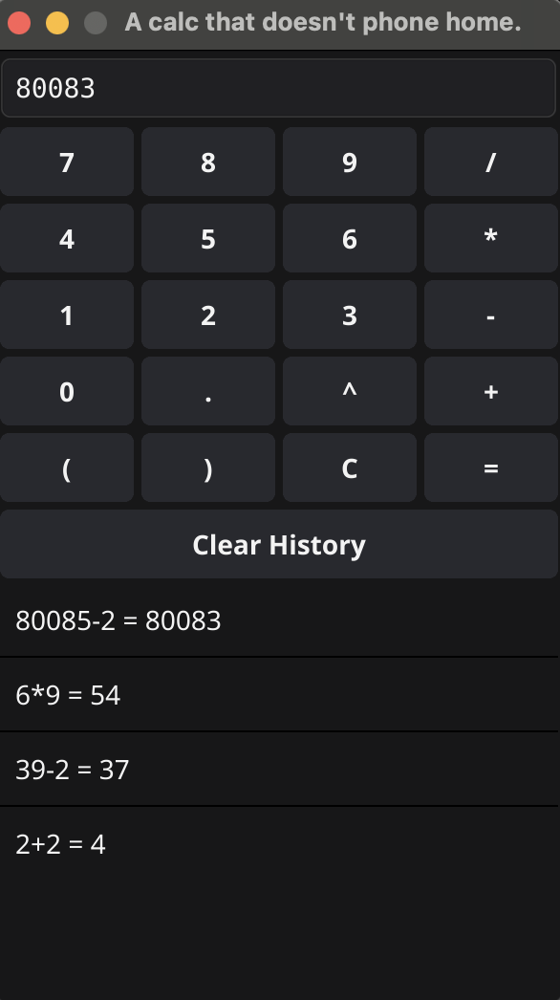

# A calc that doesn't phone home



A simple calculator application that respects your privacy. It performs calculations locally without sending any data over the network.

## Features

- Basic arithmetic operations (+, -, *, /)
- Exponentiation (^)
- Parentheses support
- Calculation history
- No network communication

## Installation

### Prerequisites

- Go 1.16 or later
- Fyne toolkit

### Steps

1. Install Go from [https://golang.org/](https://golang.org/)

2. Clone this repository:
   ```
   git clone https://github.com/IntrepidShape/calc-no-phone-home.git
   cd calc-no-phone-home
   ```

3. Install Fyne:
   ```
   go get fyne.io/fyne/v2
   ```


4. Build the application:
   ```
   go build gocalc.go
   ```

5. Run the calculator:
   ```
   ./gocalc
   ```

## Usage

- Enter expressions using the on-screen buttons or your keyboard
- Press Enter or the "=" button to evaluate
- View calculation history in the scrollable list below
- Click on a history item to load it back into the input field
- Use the "Clear History" button to erase the calculation history

